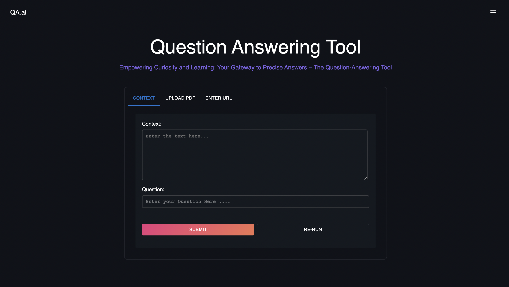
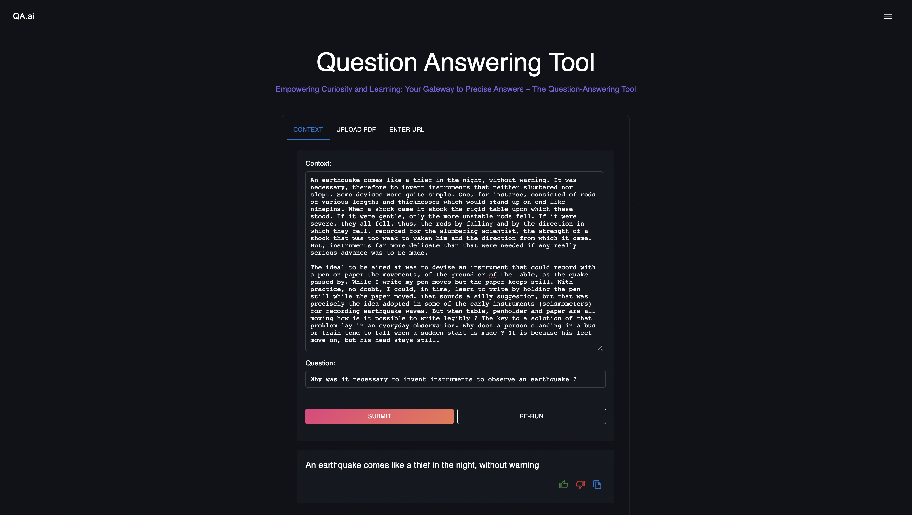

# React Question Answering App

This is a React application that allows users to input context and questions to receive answers using an API. It consists of different components for input and display.

### App Demo



## Getting Started

1. Clone this repository to your local machine.
2. Navigate to the project directory using your terminal.
3. Install the required dependencies using the following command:
   ```
   npm install
   ```
4. Start the development server:
   ```
   npm start
   ```
   This will run the app in development mode. Open [http://localhost:3000](http://localhost:3000) to view it in the browser.

## Components

The application consists of several components:

- `InputText`: Allows users to input context and questions using a text area and input field.
- `InputPDF`: Allows users to upload a PDF file and enter a question.
- `DisplayAnswer`: Displays the answer received from the API.
- `CustomTabs`: Provides tab navigation between different input options (context, PDF, URL).

## Usage

1. Select the appropriate tab (Context, Upload PDF, Enter URL).
2. Provide the required input (text, PDF file, URL) and question.
3. Click the "Submit" button to receive an answer.
4. If needed, click the "Re-Run" button to clear the input and reset.

## API Integration

The application integrates with the Hugging Face API for question answering. The `handleUserInput` function in the `CustomTabs` component sends a POST request to the API using the provided context and question.

## Customization

You can customize the styling and functionality of the components by modifying their respective code in the `src/components` directory.

## Dependencies

- React
- Material-UI
- Axios
